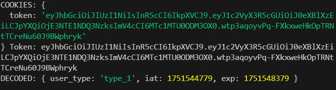

# Financialist Frontend

The frontend of the Financialist Assignment app is a Next.js application that provides a user-friendly interface for user authentication and personalized dashboards. It uses server-side rendering (SSR) for core logic, minimal client-side logic for login and logout, and Tailwind CSS for a modern, responsive UI.

## Features

- **Login Page (`/`)**:

  - Client-side form for username and password input.
  - Sends credentials to the backend (`/auth`) via Axios, sets an `httpOnly` JWT cookie (`token`), and redirects to the appropriate dashboard based on `user_type` (`type_1` or `type_2`).
  - No navigation link in the header, as specified.
  - **Screenshot**: [Insert screenshot of login page here, showing the form and clean UI without navigation.]

- **Dynamic Navigation**:

  - Server-side `RootLayout` (`layout.tsx`) checks the `token` cookie to display a **Logout** button (for authenticated users) or **Login** link (for unauthenticated users, except on `/`).
  - **Logout** button (`LogoutButton.tsx`) clears the `token` cookie client-side and reloads `/` for a fresh server render, ensuring the **Login** link appears immediately.
  - **Screenshot**: [Insert screenshot of the header on `/type_1_home` showing the **Logout** button.]

- **User Dashboards**:

  - `/type_1_home` and `/type_2_home` display personalized dashboards for `type_1` and `type_2` users, respectively, fetched from the backend’s `/profile` endpoint.
  - Server-side rendering with `getProfileData` function, which validates the `token` cookie and redirects to `/` if invalid.
  - Tailwind CSS styling with a blue (`type_1`) or green (`type_2`) user type card, feature cards, and hover effects for interactivity.
  - **Screenshot**: [Insert screenshots of `/type_1_home` and `/type_2_home` dashboards, showing the welcome message and feature cards.]

- **Middleware**:

  - Server-side middleware (`middleware.tsx`) validates the JWT `token` cookie and redirects:
    - Authenticated users from `/` to `/type_1_home` or `/type_2_home` based on `user_type`.
    - Unauthenticated users from protected routes (`/type_1_home`, `/type_2_home`) to `/`.
  - Uses `NEXT_PUBLIC_JWT_SECRET` for JWT verification.

- **Environment Variables**:

  - Configured in `.env.local` for `NEXT_PUBLIC_API_BASE_URL` (backend URL, e.g., `http://localhost:3001`) and `NEXT_PUBLIC_JWT_SECRET` for secure API calls and JWT verification.
  - Ensures no hardcoded sensitive data in the codebase.

- **Aesthetics**:
  - Tailwind CSS for a modern, responsive UI.
  - Blue header (`bg-blue-600`), gray footer (`bg-gray-800`), and gradient background (`#f3f4f6` to `#e5e7eb`).
  - Polished login form and dashboards with shadow effects, transitions, and grid layouts.

## Project Structure

```
frontend/
├── .env.local              # Environment variables (not committed)
├── .gitignore              # Ignores node_modules, .env.local
├── app/
│   ├── globals.css         # Tailwind CSS and global styles
│   ├── layout.tsx          # Server-side root layout with dynamic navigation
│   ├── LogoutButton.tsx    # Client-side logout component
│   ├── middleware.tsx      # Server-side middleware for auth routing
│   ├── page.tsx            # Client-side login page
│   ├── type_1_home/
│   │   ├── page.tsx        # Type 1 user dashboard
│   ├── type_2_home/
│   │   ├── page.tsx        # Type 2 user dashboard
├── package.json            # Dependencies and scripts
```

## Setup

1. **Clone the Repository**:

   ```bash
   git clone https://github.com/your-username/financialist-frontend.git
   cd financialist-frontend
   ```

2. **Install Dependencies**:

   ```bash
   npm install
   ```

3. **Configure Environment Variables**:

   - Create a `.env.local` file in `frontend/`:
     ```env
     NEXT_PUBLIC_API_BASE_URL=http://localhost:3001
     NEXT_PUBLIC_JWT_SECRET=4270fd848daceb84e33733b14b25f489b1ad964cb76745f3e433c429555ad50f
     ```

4. **Run Locally**:
   ```bash
   npm run dev
   ```
   - Access at `http://localhost:3000`.
   - Ensure the backend is running at `http://localhost:3001`.

## Testing

1. **Clear Cookies**:

   - In browser DevTools > Application > Cookies, clear cookies for `http://localhost:3000`.

2. **Login**:

   - Navigate to `http://localhost:3000` (or deployed URL).
   - Enter `username: type1user`, any password, and submit.
   - Verify redirection to `/type_1_home` (or `/type_2_home` for other usernames).
   - Check DevTools > Network for `/auth` request and `Set-Cookie: token=...`.

3. **Dashboards**:

   - Confirm `/type_1_home` or `/type_2_home` displays user type and feature cards.
   - Verify **Logout** button in the header.
   - Check `/profile` request in DevTools > Network.

4. **Logout**:

   - Click **Logout**, ensure redirection to `/`, and verify **Login** link appears.
   - Confirm `token` cookie is removed in DevTools > Application > Cookies.

5. **Middleware**:

   - Access `/` while logged in; middleware should redirect to the appropriate dashboard.
   - Access `/type_1_home` or `/type_2_home` without a token; middleware should redirect to `/`.
   - Check Render logs for `Middleware - Token:` and `Middleware - Decoded User Type:`.

6. **Screenshots**:
   - Verify UI matches screenshots:
     - Login page: Clean form, no navigation.
     - Dashboards: Blue/green user type card, feature grid.
     - Header: Dynamic **Login**/**Logout** button.

## Notes

- **Aesthetics**: Tailwind CSS ensures a responsive, modern UI with hover effects and consistent styling.



